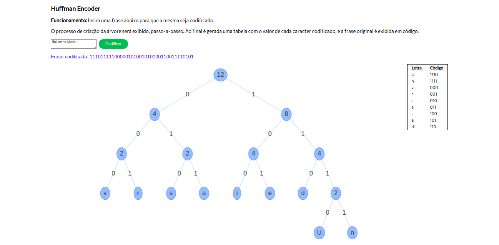

# Huffman Code

**Número da Lista**: 3 
**Conteúdo da Disciplina**: Greed 

## Alunos
|Matrícula | Aluno |
| -- | -- |
| 16/0014433  |  Maria Luiza Ferreira Assumpção Almeida |
| 15/0009313  |  Felipe de Oliveira Hargreaves |

## Sobre 
Este trabalho é uma representação visual e lógica do passo a passo do algoritmo de Huffman. O usuário pode entrar com uma palavra e esta é codificada, utilizando o algoritmo em questão. 

## Screenshots

## Instalação 
**Linguagem**: HTML/JS 

1) Clonar o repositório
2) Abrir o arquivo HTML que est na pasta templates no browser

## Uso 
O usuário deve entrar com uma palavra ou frase que deseja ser codificada. O código irá demonstrar o passo a passo da execução do algoritmo de Huffman, assim como a palavra codificada e uma legenda com o a letra e seu código. 

